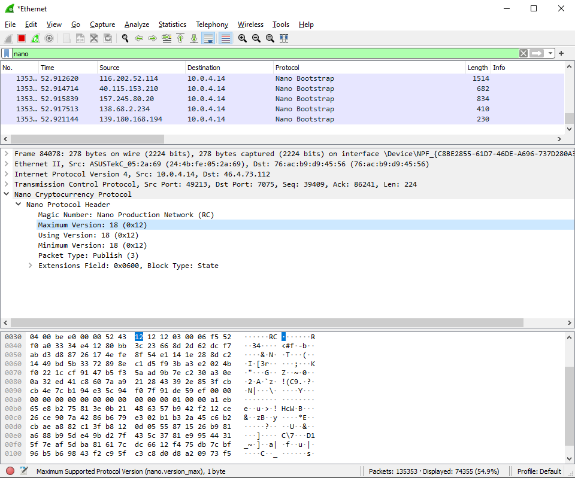
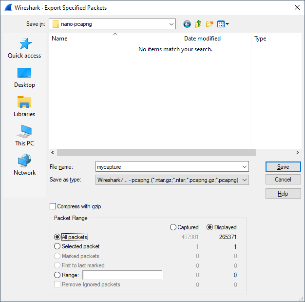

Feeless has the ability to process a network packet capture of a Nano node to investigate what each message is doing.

To do this the command-line interface has a command called `pcap`:

```asm
> feeless pcap --help

Tool to analyse network capture dumps for Nano packets

USAGE:
    feeless pcap [OPTIONS] <path>

ARGS:
    <path>

FLAGS:
    -h, --help       Prints help information
    -V, --version    Prints version information

OPTIONS:
        --end <end>                    Last packet to process
        --filter-addr <filter-addr>    Only show packets related to this IP address
    -m, --my-addr <my-addr>            The IP address of the subject, to show relative information.
                                       This is inferred automatically by the host of the first
                                       packet sent out
        --start <start>                Starting packet
```

## Guide

In order to capture packets, I've been using [Wireshark](https://www.wireshark.org/) and taking the following steps:

1. Start capturing on your network interface, then run your Nano node (or have it already running if you want to investigate mid-stream).
2. Set the filter to `nano`. You should see something like this:
   


3. Once happy with the data collected, you can optionally stop the stream.
4. You will need to export as a `pcapng` file. The best results I've found is to only export the Nano specific packets like so: `File -> Export Specified Packets`, make sure `Displayed` is selected:



5. Once saved, you should end up with a `pcapng` file you can use with Feeless with [logging](/docs/cli/overview#logging) on:

```bash
> RUST_LOG=debug feeless pcap mycapture.pcapng

Mar 23 16:07:56.348  INFO feeless::pcap: Loading dump: .\bootstrap.pcapng
Mar 23 16:07:56.352 DEBUG send_handshake:send: feeless::node::controller: OBJ Header { magic_number: 0x52, network: Live, version_max: V18, version_using: V18, version_min: V18, message_type: Handshake, ext: [Query] }
Mar 23 16:07:56.352 DEBUG send_handshake:send: feeless::node::controller: OBJ Header { magic_number: 0x52, network: Live, version_max: V18, version_using: V18, version_min: V18, message_type: Handshake, ext: [Query] }
Mar 23 16:07:56.352 DEBUG send_handshake:send: feeless::node::controller: OBJ Header { magic_number: 0x52, network: Live, version_max: V18, version_using: V18, version_min: V18, message_type: Handshake, ext: [Query] }
Mar 23 16:07:56.352 DEBUG send_handshake:send: feeless::node::controller: OBJ Header { magic_number: 0x52, network: Live, version_max: V18, version_using: V18, version_min: V18, message_type: Handshake, ext: [Query] }
Mar 23 16:07:56.352 DEBUG send_handshake:send: feeless::node::controller: OBJ Header { magic_number: 0x52, network: Live, version_max: V18, version_using: V18, version_min: V18, message_type: Handshake, ext: [Query] }
Mar 23 16:07:56.352 DEBUG send_handshake:send: feeless::node::controller: OBJ Header { magic_number: 0x52, network: Live, version_max: V18, version_using: V18, version_min: V18, message_type: Handshake, ext: [Query] }
Mar 23 16:07:56.353 DEBUG send_handshake:send: feeless::node::controller: OBJ Header { magic_number: 0x52, network: Live, version_max: V18, version_using: V18, version_min: V18, message_type: Handshake, ext: [Query] }
Mar 23 16:07:56.352 DEBUG send_handshake:send: feeless::node::controller: OBJ Header { magic_number: 0x52, network: Live, version_max: V18, version_using: V18, version_min: V18, message_type: Handshake, ext: [Query] }
Mar 23 16:07:56.353 DEBUG send_handshake:send: feeless::node::controller: OBJ Header { magic_number: 0x52, network: Live, version_max: V18, version_using: V18, version_min: V18, message_type: Handshake, ext: [Query] }
Mar 23 16:07:56.352 DEBUG send_handshake:send: feeless::node::controller: OBJ Header { magic_number: 0x52, network: Live, version_max: V18, version_using: V18, version_min: V18, message_type: Handshake, ext: [Query] }
Mar 23 16:07:56.354 DEBUG send_handshake:send: feeless::node::controller: OBJ Header { magic_number: 0x52, network: Live, version_max: V18, version_using: V18, version_min: V18, message_type: Handshake, ext: [Query] }
Mar 23 16:07:56.353 DEBUG send_handshake:send: feeless::node::controller: OBJ Header { magic_number: 0x52, network: Live, version_max: V18, version_using: V18, version_min: V18, message_type: Handshake, ext: [Query] }
Mar 23 16:07:56.353 DEBUG send_handshake:send: feeless::node::controller: OBJ HandshakeQuery(Cookie(6027D34C6CA8B2819365E5FE0B9263E4B091E103A3667E78E93F97DAA539D7E2))
Mar 23 16:07:56.353 DEBUG send_handshake:send: feeless::node::controller: OBJ HandshakeQuery(Cookie(FCEF8ABC9AA13A5C1F3CF05BB20540DBAEAD38B64022619B07246BA0E09B53D7))
Mar 23 16:07:56.353 DEBUG send_handshake:send: feeless::node::controller: OBJ Header { magic_number: 0x52, network: Live, version_max: V18, version_using: V18, version_min: V18, message_type: Handshake, ext: [Query] }
Mar 23 16:07:56.353 DEBUG send_handshake:send: feeless::node::controller: OBJ HandshakeQuery(Cookie(596A513955CB32B957643A7BFF974E6914D4FAB692A87263273CE2FE6B051599))
Mar 23 16:07:56.353 DEBUG send_handshake:send: feeless::node::controller: OBJ HandshakeQuery(Cookie(BC617557163834A2CA813BEF9A317177A6C3708998A8E7AAF3CCA4D4D405F792))
Mar 23 16:07:56.353 DEBUG send_handshake:send: feeless::node::controller: OBJ HandshakeQuery(Cookie(1E7B606C1D6A22E3A3748A1C646F63DCDA1C8F1F4DD181F7C56BD3B06D81CC28))
```
